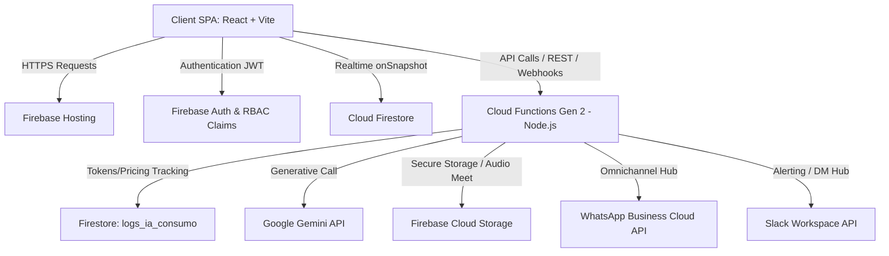

# Manual de Referencia Técnica y Arquitectura del Sistema
### CRM-Luxia · Especificación de Software & Protocolos Regionales

Este documento es la referencia técnica maestra que detalla los principios de diseño, la topología serverless, la lógica de FinOps, los guardarraíles de seguridad y los flujos de orquestación de todos los módulos que integran el ecosistema **CRM-Luxia**.

---

## 01. Arquitectura General y Topología Serverless [roles: admin, superadmin]
El CRM-Luxia está implementado sobre una topología serverless orientada a eventos, diseñada para escalar de forma elástica minimizando costos fijos y latencias regionales en LATAM.



### Detalle de Componentes
1.  **Client SPA (Single Page Application):** React + Vite. Utiliza estilos de Bootstrap 5. Implementa el hook centralizado `useUserRole` para la evaluación client-side de permisos y vistas selectivas.
2.  **Firebase Hosting:** Distribución global de recursos estáticos del frontend (HTML, JS, CSS y archivos de documentación `.md` en `/docs`).
3.  **Firebase Authentication:** Autenticación unificada mediante JSON Web Tokens (JWT).
    *   *Custom Claims:* Inyección del rol del usuario (`lector`, `agente`, `agente_cx`, `supervisor`, `supervisor_cx`, `admin`, `superadmin`) directamente en los metadatos del token para validación en reglas de seguridad de Firestore y Storage.
4.  **Cloud Firestore (NoSQL):** Almacenamiento persistente en tiempo real. Configurado con persistencia local IndexedDB (`enableIndexedDbPersistence`) para permitir navegación y visualización offline en zonas sin cobertura de red.
5.  **Cloud Functions Gen 2 (Node.js/TypeScript):** Funciones callable y endpoints HTTPS. Configurada una escala mínima de instancias virtuales activas para mitigar el efecto de arranque en frío (Cold Start) en endpoints críticos como la recepción de webhooks de WhatsApp.
6.  **Firebase Cloud Storage:** Almacén seguro para archivos adjuntos de clientes, bitácoras de importaciones masivas y ficheros de audio `.mp3` generados por el grabador local de Google Meet.

---

## 02. Modelo de Datos y Esquema Firestore [roles: admin, superadmin]
La base de datos Firestore está estructurada en colecciones raíz y subcolecciones relacionales optimizadas para lecturas masivas paralelas y búsquedas por iniciales.

```
/usuarios/{uid}
  ├── email (string)
  ├── nombre (string)
  ├── equipo (string)
  ├── rol (string: superadmin | admin | supervisor | agente | lector | agente_cx | supervisor_cx)
  └── capacitacion (map: estado [certificado | pendiente], ultimaFechaExamen [timestamp])

/equipos/{equipoId}
  ├── id (string)
  ├── nombre (string)
  └── participaGamificacion (boolean)

/config_secciones/{seccionId}
  ├── id (string)
  ├── nombre (string)
  ├── icono (string)
  ├── orden (number)
  └── entidad (string: cliente | contrato | contacto | actividad)

/config_campos/{campoId}
  ├── id (string)
  ├── key (string)
  ├── nombre (string)
  ├── tipo (string: text | number | select | checkbox | date | file)
  ├── seccionId (string)
  ├── orden (number)
  ├── opciones (array of strings)
  ├── origenDatos (string: manual | servicios | usuarios | clientes)
  ├── obligatorio (boolean)
  └── generaAlerta (boolean)

/config_onboarding/{hitoId}
  ├── id (string)
  ├── titulo (string)
  ├── orden (number)
  ├── evidenciaObligatoria (boolean)
  ├── paises (array: ['Global'] o códigos de país)
  └── servicios (array: ['Global'] o IDs de servicio)

/clientes/{clienteId}
  ├── nombre (string)
  ├── pais (string: PE | MX | CL | CO | AR)
  ├── faseComercial (string: adquisicion | retencion | onboarding | activo)
  ├── comercialId (string)
  ├── searchTokens (array: iniciales y variaciones para Sentinel Search)
  ├── healthScore (number: 0-100)
  ├── lastUpdated (timestamp)
  ├── /contratos/{contratoId}
  │     ├── nombre (string)
  │     ├── monto (number: moneda local)
  │     ├── moneda (string)
  │     ├── montoUSD (number)
  │     ├── fechaInicio (timestamp)
  │     ├── fechaVencimiento (timestamp)
  │     ├── renovacionAutomatica (boolean)
  │     ├── alertaDiasAnticipacion (number)
  │     └── version (number)
  ├── /onboarding/{hitoId}
  │     ├── completado (boolean)
  │     ├── fechaCompletado (timestamp)
  │     ├── evidenciaUrl (string)
  │     └── responsableEmail (string)
  └── /interacciones/{interaccionId}
        ├── tipo (string: email | whatsapp | nota | meet)
        ├── contenido (string)
        ├── autor (string)
        ├── timestamp (timestamp)
        └── esSusurro (boolean)

/contactos/{contactoId}
  ├── clienteId (string)
  ├── leadId (string opcional)
  ├── oportunidadId (string opcional)
  ├── nombre (string)
  ├── correo / email (string)
  ├── telefono (string)
  ├── cargo / puesto (string)
  ├── linkedin (string: URL del perfil profesional de LinkedIn)
  ├── referidoPorNombre (string opcional)
  ├── referidoPorEmail (string opcional)
  ├── recibirInformacion (boolean)
  └── camposDinamicos (map)

/oportunidades/{oportunidadId}
  ├── nombre (string)
  ├── clienteId (string)
  ├── comercialEmail (string)
  ├── division (string: adquisicion | retencion)
  ├── tipoServicio (string)
  ├── etapaId (string)
  ├── montoEstimadoMensual (number)
  ├── moneda (string)
  ├── montoUSD (number)
  └── fechaEstimadaCierre (timestamp)

/config_general/pipeline_config
  ├── {pipelineId}_{serviceId} (map)
  │     ├── stages (array of maps: id, label, orden, probabilidad)
  │     ├── formFields (array of strings)
  │     └── gatekeeping (map: stageId -> array of required field keys)
  └── lossReasons (array of maps: id, label, active, orden)
```

---

## 03. Autenticación y Matriz de Permisos RBAC [roles: admin, superadmin]
El control de accesos del CRM-Luxia aplica políticas estrictas de Zero-Trust basadas en privilegios de perfil de usuario.

### Estructura de claims JWT y validación
Al iniciar sesión, Firebase Auth evalúa el documento `/usuarios/{uid}`. Si el rol es modificado, las Cloud Functions asignan Custom Claims al token JWT:
```javascript
// Cloud Function Trigger: onUserRoleChange
await admin.auth().setCustomUserClaims(uid, {
  role: newRole,
  isAdmin: ['admin', 'superadmin'].includes(newRole),
  isSupervisor: ['supervisor', 'supervisor_cx', 'admin', 'superadmin'].includes(newRole)
});
```

### Reglas de Seguridad de Firestore (Security Rules)
Las reglas restringen el acceso a los datos según las claims del token. Ejemplo de aislamiento comercial:
```javascript
service cloud.firestore {
  match /databases/{database}/documents {
    match /clientes/{clienteId} {
      allow read: if request.auth != null && (
        request.auth.token.isAdmin == true ||
        resource.data.comercialId == request.auth.uid ||
        (request.auth.token.isSupervisor == true && resource.data.pais == request.auth.token.pais)
      );
      allow write: if request.auth != null && request.auth.token.role != 'lector';
    }
  }
}
```

### Ámbitos de Visibilidad de Datos Dinámicos (Data Scopes)
Para garantizar la segregación y granularidad en el acceso a nivel de registros (filas), el CRM implementa un sistema de **Ámbitos de Visibilidad (Data Scopes)**. La configuración se almacena en la propiedad `scopes` del documento `/config_permisos/rol_matrix`:
*   **`ALL`**: Permite la visualización de la totalidad de registros de la entidad.
*   **`TEAM`**: Limita la lectura a registros pertenecientes al mismo equipo organizativo (ej: `adquisicion` o `retencion`), normalizados vía Unicode NFD.
*   **`OWN`**: Limita la lectura estrictamente a registros donde el usuario logueado figure como el comercial asignado o creador.
*   **`NONE`**: Denegación completa de visibilidad.

La resolución se ejecuta transversalmente en:
1.  **Frontend (Contexto React):** El proveedor `UserRoleContext` expone `getDataScope(entityKey)`, inyectando filtros reactivos en las consultas locales de Firestore.
2.  **Carga Masiva (`BulkImportModal.jsx`):** Durante la pre-validación de filas del CSV, se evalúa el ámbito del usuario para rechazar registros asignados a comerciales de otros equipos (`TEAM`) o a correos distintos del operador (`OWN`).
3.  **Backend (Cloud Functions):** La función `/exportarDatos` lee dinámicamente `/config_permisos/rol_matrix` en el servidor para aplicar las restricciones de visibilidad de filas en las consultas a nivel de nube antes de construir el archivo comprimido.

### Control de Inactividad y Desconexión
La desconexión automática es gestionada en el frontend por `AgentPresenceMonitor.jsx`. Configura listeners locales para capturar eventos de mouse, teclado o interacción táctil (`mousemove`, `keydown`, `touchstart`). Si transcurre el tiempo parametrizado en `/config_general/security_config` sin eventos, destruye la sesión y el token de Firebase Auth. Si el modal de confirmación está abierto, los listeners se apagan, requiriendo un clic consciente del operador para reactivar la sesión y evitando clicks accidentales.

### Invariante Arquitectónica: Asignación del Equipo Global para Administradores
Por especificación de arquitectura y control de acceso regional, la asignación de equipo para roles administrativos cumple la siguiente restricción formal:
$$\text{Rol} \in \{\text{admin}, \text{superadmin}\} \implies \text{Equipo} = \text{'Global'}$$

Esta regla se garantiza en tres capas del sistema:
1. **Frontend (`UsersConfigPanel.jsx`):** El selector de equipo se bloquea y se fuerza a `Global` reactivamente al seleccionar o editar un usuario a los roles `admin` o `superadmin`.
2. **Ciclo de Vida de Autenticación (`App.jsx`):** La migración de datos legados y la activación diferida de invitaciones (*Lazy Activation*) forzan el atributo `equipo: 'Global'` en el documento `/usuarios/{uid}` al detectar un rol administrativo.
3. **Auditoría de Base de Datos (`enforce-admin-global-team.cjs`):** Script de migración server-side que corrige y mantiene la consistencia en las colecciones `/usuarios` e `/invitaciones`.

---

## 04. Motor de Inteligencia Artificial (Sentinel Engine) [roles: admin, superadmin]
El CRM integra la API de Google Gemini para tareas de análisis, scoring, traducción y corrección.

### Arquitectura de Agentes Sentinel
1.  **Sentinel Lead Scorer:** Ejecuta la calificación IA de leads. Compara la información corporativa y transcripciones de la primera llamada con el ICP configurado. Retorna obligatoriamente un JSON plano sin comillas Markdown:
    ```json
    {
      "score": 85,
      "prioridad": "Green",
      "analisis_viabilidad": "Walmart cuenta con operaciones en Perú, un volumen proyectado alto y requiere integración vía API para colectas automatizadas.",
      "proximos_pasos": [
        "Agendar demo de integración API",
        "Presentar propuesta de tarifas Tier 1"
      ]
    }
    ```
2.  **Sentinel Risk Engine (Health Score):** Analiza la bitácora de interacciones de los últimos 60 días, tickets abiertos en CX, estados de onboarding y vigencia de contratos. Ejecuta una agregación weighted y corrección con Gemini para justificar variaciones.
3.  **Sentinel Architect (Metrics Studio):** Traduce instrucciones en lenguaje natural en consultas y agregaciones estructuradas para el dashboard de KPIs.
    *   *Few-Shot Context:* RAG técnico de estructuras de colecciones Firestore para evitar consultas inválidas.
    *   *Payload de Definición de KPI:*
        ```json
        {
          "id": "kpi_12345",
          "nombre": "Volumen de Tratos Ganados en Perú",
          "collection": "oportunidades",
          "queryConfig": {
            "filters": [
              { "field": "etapaId", "operator": "==", "value": "ganado" },
              { "field": "pais", "operator": "==", "value": "PE" }
            ],
            "aggregation": "sum",
            "fieldToAggregate": "montoUSD"
          },
          "chartType": "bar",
          "status": "active"
        }
      ```
4.  **Triage de Bitácora:** Filtra interacciones salientes antes de procesar por el Risk Engine para evitar sobrefacturación en llamadas de IA eliminando saludos e información vacía.

### Módulo FinOps & Presupuesto IA (Circuit Breaker)
Al ejecutarse cualquier Cloud Function de IA (`supportAgent`, `sentinelScorer`, etc.), se incrementa de forma transaccional el costo del token consumido en `/config_ia/sentinel_usage`.
*   *Lógica del Circuit Breaker:*
    ```javascript
    const usageRef = db.collection("config_ia").doc("sentinel_usage");
    const usageDoc = await usageRef.get();
    if (usageDoc.exists) {
      const usage = usageDoc.data();
      if (usage.autoshutoffActive && usage.accumulatedCostUsd >= usage.budgetLimitUsd) {
        // Circuit Breaker Activo
        await usageRef.update({ disabledByBudget: true });
        throw new Error("Presupuesto mensual agotado. Servicios de IA suspendidos.");
      }
    }
    ```

---

## 05. Sub-Sistemas de Integración y Webhooks [roles: admin, superadmin]
Orquestación e intercambio de datos con integraciones externas y APIs.

### WhatsApp Business API Webhooks (Debouncing y Búfer)
Para mitigar la carga de escrituras simultáneas en Firestore por chats activos, la Cloud Function `/whatsappWebhook` implementa un buffer temporal de mensajes (debouncing de 3 segundos por remitente). Acumula los mensajes entrantes en memoria local antes de insertar un documento consolidador en la subcolección `/interacciones` del cliente.

### Google Meet Integración & Grabadora HTML5
*   *Consentimiento Legal:* La creación de la llamada exige pasar el flag `legalConsentGiven: true` en el payload.
*   *Grabación Directa en Cliente:* Para cuentas Workspace Starter sin API de grabación nativa, el CRM inyecta un módulo local WebRTC. Captura el stream de audio del micrófono y del sistema mediante `MediaRecorder` de HTML5 y transmite fragmentos binarios (Chunks) a Firebase Cloud Storage al finalizar la sesión.
*   *Transcripción diarizada:* La Cloud Function activa el servicio Speech-to-Text de Google Cloud configurando `diarizationConfig` para separar las intervenciones del comercial y del cliente.

### Consola de APIs & Seguridad de Webhooks Salientes
*   **Firma Criptográfica HMAC-SHA256:** Cada llamada de webhook saliente (Outbound Webhooks) hacia sistemas del cliente incluye un encabezado de firma `X-Luxia-Signature` generado mediante la clave secreta configurada.
    *   *Cálculo de firma (Node.js):*
        ```javascript
        const crypto = require('crypto');
        const signature = crypto
          .createHmac('sha256', clientWebhookSecret)
          .update(JSON.stringify(payload))
          .digest('hex');
        ```

---

## 06. Sincronización de Base de Conocimientos & CI/CD [roles: admin, superadmin]
Automatización y despliegue continuo de la base de conocimientos maestra de CRM-Luxia.

```
                  [ manual_operaciones.md ]
                             │
                             ▼
  [ Scripts / migrate-manuals-to-firestore.cjs ] ──> Parsea tags [roles: ...]
                             │
                             ▼
                [ Firestore Collections ]
    /documentacion_maestra/manual_operaciones/secciones
                             │
                             ▼
         [ Cloud Function: supportAgent.js ] ──> Inyecta rol del usuario
                             │
                             ▼
                    [ Gemini 2.5 API ]
```

1.  **Fase de CI/CD (Subida de Manuales):** El script `migrate-manuals-to-firestore.cjs` es ejecutado tras cada despliegue de software o manualmente por el administrador. Parsea el archivo `manual_operaciones.md`, separando las secciones por los encabezados `##` y leyendo el contenido en Markdown limpio. Almacena las secciones en documentos individuales ordenados por el campo `orden` e inyecta el array de `roles` extraído.
2.  **Fase de Ingestión en supportAgent:** La Cloud Function carga dinámicamente todas las secciones de `/documentacion_maestra/manual_operaciones/secciones` y `/documentacion_maestra/referencia_tecnica/secciones` y concatena sus contenidos. Inyecta este contexto en la instrucción de sistema de Gemini junto con el rol de usuario recuperado en caliente, garantizando que el Soporte IA sea dinámicamente consciente de los permisos de quien consulta.
3.  **Fase de Sincronización Vectorial RAG (Hot Sync & Hash Validation):** La Cloud Function Callable `syncRagEmbeddings` realiza un barrido en caliente de los manuales en Firestore:
    *   Genera un hash SHA-256 a partir del contenido consolidado de todas las secciones.
    *   Compara este hash con `lastHash` en `/config_ia/rag_status`. Si son idénticos, devuelve `{ success: true, updated: false }` para abortar la indexación a coste cero.
    *   Si hay cambios, regenera los embeddings llamando al modelo `gemini-embedding-2`, limpia la colección `/documentacion_embeddings`, inserta los nuevos fragmentos vectorizados en lotes atómicos y actualiza `/config_ia/rag_status`.
4.  **Auditor KB Dinámico (`onNegativeFeedbackCreated`):** Trigger de base de datos que se activa ante un feedback negativo del usuario. Carga en caliente la configuración del agente desde `/config_ia/sentinel_ia_auditor`, resuelve el modelo activo mediante `/config_ia_modelos` y formatea dinámicamente los marcadores de posición `{{originalInput}}`, `{{generatedOutput}}` y `{{correctedContent}}` en la instrucción del sistema antes de invocar a Gemini.
