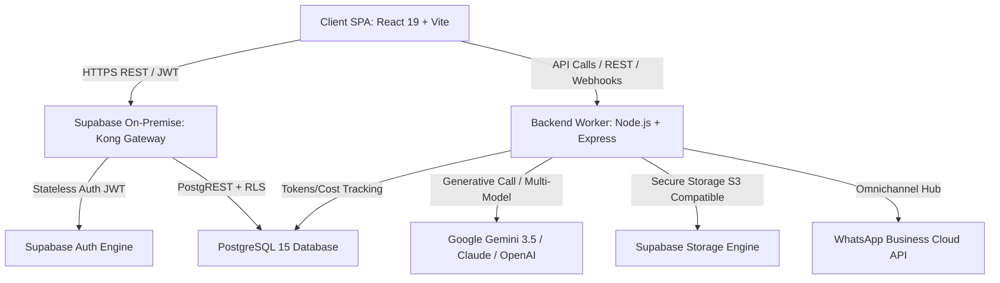

# Manual de Referencia Técnica y Arquitectura del Sistema
### CRM-Luxia · Especificación de Software & Protocolos Regionales

Este documento es la referencia técnica maestra que detalla los principios de diseño, la topología de servicios, la persistencia en PostgreSQL con Supabase, los guardarraíles de seguridad declarativa (RLS) y los flujos de orquestación de todos los módulos que integran el ecosistema **CRM-Luxia**.

---

## 01. Arquitectura General y Topología de Servicios [roles: admin, superadmin]
El CRM-Luxia está implementado sobre una arquitectura moderna desacoplada en dos capas principales: una Single Page Application (SPA) client-side y un backend worker dedicado, operando sobre un clúster on-premise de PostgreSQL gestionado mediante Supabase.



### Detalle de Componentes
1. **Client SPA (Single Page Application):** React 19 + Vite. Utiliza Sistema de Diseño Apple Liquid Glass (Vanilla CSS). Implementa el contexto centralizado `UserRoleContext` para la evaluación client-side de permisos, scopes de datos (`ALL`, `TEAM`, `OWN`) y vistas selectivas.
2. **Kong API Gateway (Supabase):** Ruteo centralizado de peticiones REST bajo puerto 8000 (`http://192.168.0.70:8000`), resolviendo la autenticación y reenvío a PostgREST.
3. **Supabase Authentication:** Autenticación unificada mediante JSON Web Tokens (JWT) firmados criptográficamente. Inyecta el identificador único (`auth.uid()`) y valida la sesión activa del operador.
4. **PostgreSQL 15 con Row-Level Security (RLS):** Capa de persistencia relacional estricta. Toda sentencia SQL está protegida por políticas RLS activas en tablas sensibles (`usuarios`, `clientes`, `oportunidades`, `contratos`, `leads`, `api_keys`, `logs_sistema`, `logs_ia_consumo`, `incoming_api_logs`).
5. **Backend Worker & API Gateway (Node.js/Express en puerto 4000):** Microservicio dedicado para tareas asíncronas, webhooks entrantes, cron jobs de mantenimiento, sincronización de health score y llamadas seguras a modelos de IA sin exponer API Keys en el cliente.
6. **Supabase Storage:** Almacén seguro para archivos adjuntos de clientes, contratos firmados, remitos y grabaciones de audio de reuniones de Google Meet.

---

## 02. Modelo de Datos y Esquema Relacional PostgreSQL [roles: admin, superadmin]
La base de datos opera sobre esquemas normalizados con índices optimizados y tipos de datos fuertemente tipados.

```sql
-- Tabla de Usuarios y Perfiles RBAC
CREATE TABLE public.usuarios (
    id UUID PRIMARY KEY REFERENCES auth.users(id) ON DELETE CASCADE,
    email TEXT UNIQUE NOT NULL,
    nombre TEXT,
    rol TEXT NOT NULL CHECK (rol IN ('superadmin', 'admin', 'supervisor', 'agente', 'lector', 'editor')),
    equipo TEXT DEFAULT 'Global',
    pais TEXT DEFAULT 'AR',
    activo BOOLEAN DEFAULT true,
    last_active_at TIMESTAMPTZ,
    capacitacion JSONB DEFAULT '{}'::jsonb,
    gmail_sync JSONB DEFAULT '{}'::jsonb,
    estado_presencia TEXT DEFAULT 'desconectado',
    presencia JSONB DEFAULT '{}'::jsonb,
    created_at TIMESTAMPTZ DEFAULT now(),
    updated_at TIMESTAMPTZ DEFAULT now()
);

-- Tabla de Clientes y Cuentas Corporativas
CREATE TABLE public.clientes (
    id TEXT PRIMARY KEY,
    nombre_empresa TEXT NOT NULL,
    cuit_rut_rfc TEXT,
    industria TEXT,
    sitio_web TEXT,
    tamanio_empresa TEXT,
    tier_cuenta TEXT DEFAULT 'Tier 3',
    tier_override BOOLEAN DEFAULT false,
    parent_company_id TEXT,
    estado TEXT DEFAULT 'activo',
    fase_manual TEXT,
    pais TEXT NOT NULL,
    comercial_email TEXT,
    comercial_id UUID REFERENCES public.usuarios(id),
    observaciones TEXT,
    health_score NUMERIC DEFAULT 100,
    campos_dinamicos JSONB DEFAULT '{}'::jsonb,
    fecha_ingreso TIMESTAMPTZ DEFAULT now(),
    created_at TIMESTAMPTZ DEFAULT now(),
    updated_at TIMESTAMPTZ DEFAULT now()
);

-- Tabla de Oportunidades Comerciales
CREATE TABLE public.oportunidades (
    id TEXT PRIMARY KEY,
    cliente_id TEXT REFERENCES public.clientes(id) ON DELETE CASCADE,
    nombre TEXT NOT NULL,
    etapa TEXT NOT NULL,
    monto_estimado_mensual NUMERIC DEFAULT 0,
    valor_contrato_anual NUMERIC DEFAULT 0,
    descuento_ofrecido_pct NUMERIC DEFAULT 0,
    contacto_principal_id TEXT,
    probabilidad NUMERIC DEFAULT 0,
    fecha_estimada_cierre TIMESTAMPTZ,
    fecha_ultimo_cambio_etapa TIMESTAMPTZ,
    competidor_ganador TEXT,
    perdida_razon TEXT,
    perdida_detalle TEXT,
    comercial_email TEXT,
    comercial_id UUID REFERENCES public.usuarios(id),
    pais TEXT NOT NULL,
    tipo_pipeline TEXT DEFAULT 'adquisicion',
    tipo_servicio TEXT,
    campos_dinamicos JSONB DEFAULT '{}'::jsonb,
    created_at TIMESTAMPTZ DEFAULT now(),
    updated_at TIMESTAMPTZ DEFAULT now()
);

-- Tabla de Contratos y Acuerdos Comerciales
CREATE TABLE public.contratos (
    id TEXT PRIMARY KEY,
    cliente_id TEXT NOT NULL REFERENCES public.clientes(id) ON DELETE CASCADE,
    monto NUMERIC NOT NULL,
    moneda TEXT NOT NULL,
    es_contrato_vigente BOOLEAN DEFAULT true,
    fecha_inicio DATE NOT NULL,
    fecha_vencimiento DATE NOT NULL,
    modalidad_pago TEXT,
    renovacion_automatica BOOLEAN DEFAULT false,
    alerta_dias_anticipacion INTEGER DEFAULT 30,
    version INTEGER DEFAULT 1,
    archivo_url TEXT,
    campos_dinamicos JSONB DEFAULT '{}'::jsonb,
    created_at TIMESTAMPTZ DEFAULT now(),
    updated_at TIMESTAMPTZ DEFAULT now()
);
```

---

## 03. Autenticación y Matriz de Permisos RBAC [roles: admin, superadmin]
El control de acceso descansa sobre 6 roles oficiales del sistema:

| Rol | Identificador | Nivel de Privilegios | Data Scope Típico |
| :--- | :--- | :--- | :--- |
| **SuperAdmin** | `superadmin` | Acceso irrestricto, configuración de seguridad, RLS, prompts de IA y observabilidad. | `ALL` (Global) |
| **Administrador** | `admin` | Gestión de catálogo de servicios, campos dinámicos, usuarios e integraciones. | `ALL` (Global) |
| **Supervisor** | `supervisor` | Coordinación de equipo comercial, asignaciones masivas y aprobación de hitos. | `TEAM` (Equipo Asignado) |
| **Agente Comercial** | `agente` | Gestión operativa a campo de leads, oportunidades y cuentas asignadas. | `OWN` (Propio) |
| **Editor** | `editor` | Edición operativa de oportunidades, contratos y avance de hitos de onboarding. | `ALL` o `TEAM` |
| **Lector** | `lector` | Visualización y auditoría de dashboards y reportes en modo solo lectura. | `ALL` (Solo Lectura) |

---

## 04. Motor de Inteligencia Artificial (Luxia Engine) [roles: admin, superadmin]
El subsistema de IA está integrado en el backend mediante `server/services/luxiaCore.js`:

1. **Luxia Sentinel Engine (Health Score):** Analiza la bitácora de interacciones, mora en cuentas, vencimiento de contratos y cumplimiento de volumen. Computa un puntaje ponderado de 0 a 100 con clasificación semafórica:
   - 🟢 **Green (75-100 pts):** Cuenta saludable y al día.
   - 🟡 **Yellow (40-74 pts):** Señales preventivas de riesgo financiero o demoras moderadas.
   - 🔴 **Red (0-39 pts):** Riesgo crítico de Churn o facturas vencidas >60 días.
2. **Luxia Lead Scorer:** Pondera la idoneidad firmográfica de prospectos en el buzón de entrada recomendando el Tier comercial adecuado.
3. **Luxia Exam Evaluator:** Corrige las respuestas a casos prácticos en el módulo de capacitación, generando devoluciones pedagógicas inmediatas.

---

## 05. Sub-Sistemas de Integración y Webhooks [roles: admin, superadmin]

### Ingesta B2B (Inbound REST API)
Todos los endpoints externos autenticados requieren la cabecera:
`Authorization: Bearer <API_KEY>` o `x-api-key: <API_KEY>`

* `POST /api/v1/leads`: Alta automatizada de prospectos calificados.
* `POST /api/v1/clientes`: Sincronización bidireccional con sistemas ERP (SAP, Tango, Oracle).
* `POST /api/v1/contratos`: Registro formal de contratos comerciales.

### Webhooks Salientes (Outbound Webhooks)
El sistema despacha eventos en tiempo real con firma criptográfica HMAC-SHA256 en la cabecera `X-Luxia-Signature` ante los eventos:
* `lead.created` / `lead.qualified`
* `opportunity.stage_changed` / `opportunity.won`
* `contract.signed` / `contract.expiring_soon`
* `client.health_critical`

---

## 06. Sincronización de Base de Conocimientos & RAG [roles: admin, superadmin]
La base de conocimiento de la plataforma se sincroniza automáticamente en la tabla `config_general` de PostgreSQL. El agente de soporte interactivo (`/api/soporte-agent`) utiliza estos manuales como fuente canónica de verdad (grounding estricto) para responder las consultas de los usuarios sin inventar funcionalidades.
